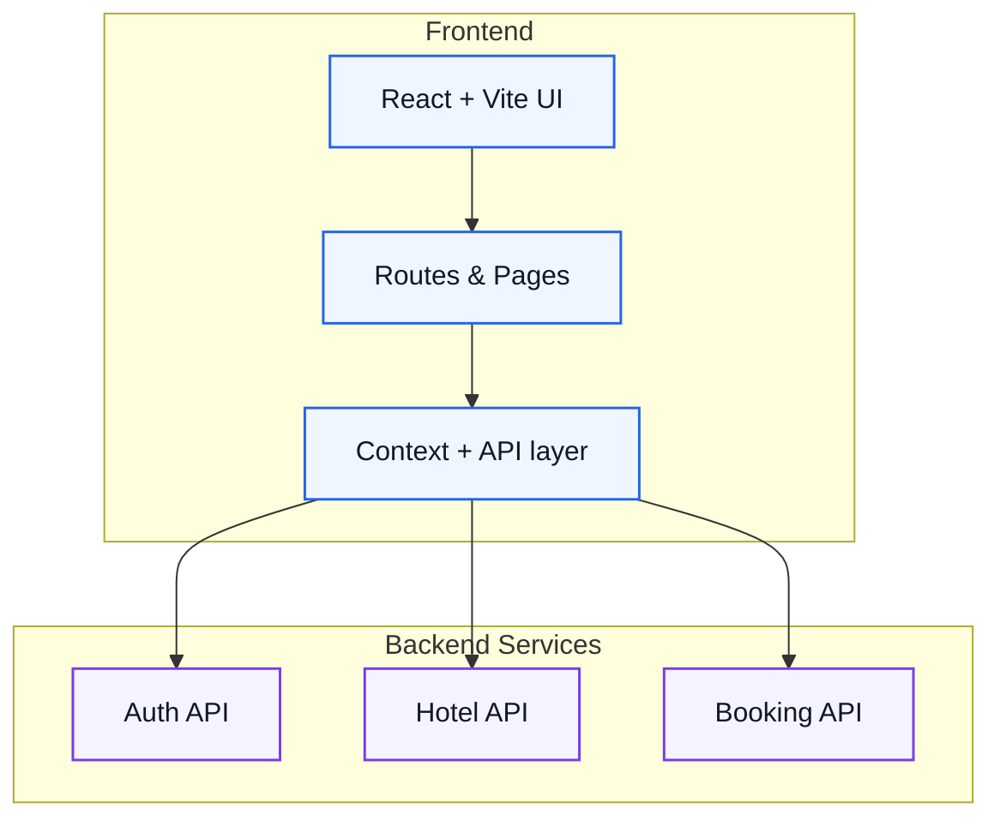
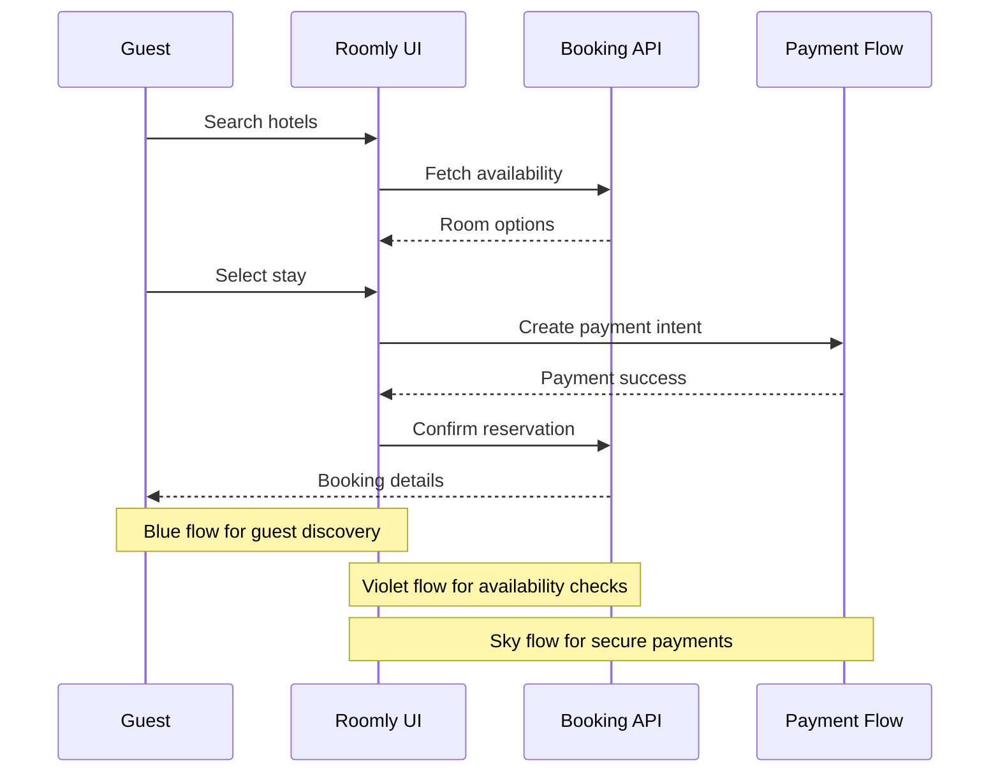

# Roomly — Premium Hotel Booking & Management Platform

Roomly is a polished hotel discovery and management experience for modern travelers and property managers. It combines a premium guest journey with a powerful admin workspace, all wrapped in a clean, high-conversion interface.

<div align="center">
  <p><strong>Luxury stays • Smart operations • Fast bookings</strong></p>
</div>

## ✨ What Roomly offers

- Fast hotel discovery with rich search and availability flows
- Guided booking experience for guests from search to confirmation
- Admin tools for hotels, rooms, inventory, and reporting
- Secure authentication and profile-based guest management

## 🧭 Product overview


## 🏗️ Architecture



## 🔄 Booking flow



## 🚀 Getting started

### Prerequisites

- Node.js 18+
- npm

### Install

```bash
npm install
```

### Run locally

```bash
npm run dev
```

### Environment

Create a .env file with:

```env
VITE_API_BASE_URL=http://localhost:9091
```

## 📁 Project structure

```text
src/
├── api/          # API services
├── components/   # Reusable UI components
├── context/      # Auth and shared state
├── pages/        # Guest and admin pages
├── routes/       # Route configuration
└── utils/        # Helper functions
```

## 🎨 Brand direction

Roomly emphasizes clarity, calm luxury, and high-trust interactions. The interface leans on soft gradients, glassmorphism, and fast feedback loops to keep the experience feeling premium without being overwhelming.

---

Built with care for modern hospitality experiences.
