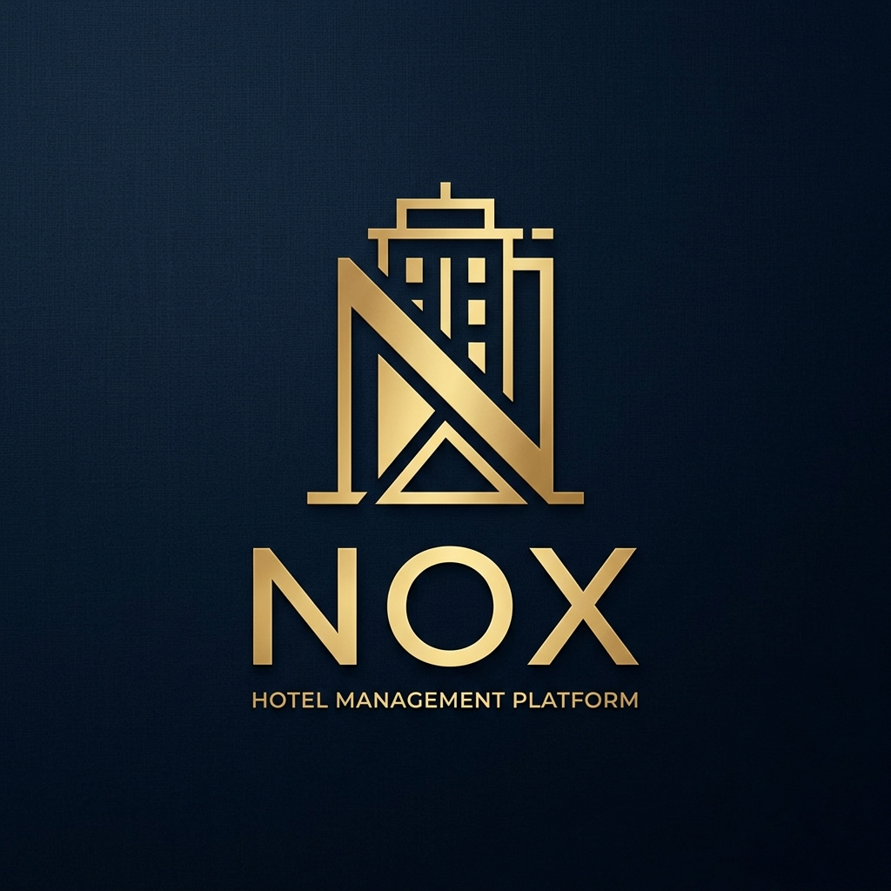

<div align="center">
  
  <h1>Nox — Premium Hotel Management Platform</h1>
  <p><i>Sophisticated. Seamless. State-of-the-Art.</i></p>

  [](https://react.dev/)
  [](https://vitejs.dev/)
  [](https://tailwindcss.com/)
  [](https://www.framer.com/motion/)
  [](https://redux-toolkit.js.org/)
</div>

---

## 🌟 Overview

**Nox** is a next-generation Online Travel Agency (OTA) and Hotel Management platform. It bridges the gap between luxury traveler expectations and operational excellence for hotel managers. 

Built with a **Deep-Blue Premium Aesthetic**, Nox utilizes advanced glassmorphism and motion design to provide an immersive discover-and-book experience.

---

## ✨ Key Features

### 🛖 Traveler Experience
- **Intelligent Search**: High-conversion search bar with location-aware inventory lookup and real-time availability.
- **Sequential Booking Funnel**: A frictionless 4-step modal flow (`Select` → `Guests` → `Payment` → `Confirmation`).
- **Interactive Mapping**: Leaflet-powered map integration showing real-time proximity and pricing for hotels.
- **Dynamic Pricing**: Real-time room availability and price synchronization (₹) using a modular backend architecture.
- **Guest Profile Management**: CRUD operations for "Saved Guests" to enable lightning-fast repeat bookings.
- **Support Center**: Category-based contact system powered by EmailJS with real-time validation.

### 📊 Manager Suite (ERP)
- **Analytics Dashboard**: Comprehensive KPI tracking for revenue, occupancy, and booking trends with large visual cards.
- **Inventory Control**: Granular "Closed-to-Arrival" toggles and bulk price overrides for seasonal shifts.
- **Property Management**: Complete CRUD suite for managing multi-property scales (Hotels & Room Types).
- **Booking Ledger**: Detailed audit view for all reservations, guest details, and financial tracking.

---

## 🛠️ Technology Stack

| Layer | Technology |
| :--- | :--- |
| **Framework** | [React 19](https://react.dev/) (Functional Components, Hooks) |
| **Build Tool** | [Vite 8](https://vitejs.dev/) |
| **Styling** | [Tailwind CSS 4](https://tailwindcss.com/) & Glassmorphism Design System |
| **Animations** | [Framer Motion 12](https://www.framer.com/motion/) |
| **State Management** | [Redux Toolkit](https://redux-toolkit.js.org/) & Context API |
| **API Client** | [Axios](https://axios-http.com/) (with JWT Interceptors & Token Rotation) |
| **Maps** | [Leaflet](https://leafletjs.com/) & React Leaflet |
| **Forms** | [React Hook Form](https://react-hook-form.com/) |
| **Icons** | [Lucide React](https://lucide.dev/) |

---

## 🚀 Getting Started

### Prerequisites
- **Node.js**: v18 or higher
- **Package Manager**: npm or yarn
- **Backend**: Ensure the Nox Backend (Spring Boot) is running on port `9091`.

### Installation

1. **Clone the repository**
   ```bash
   git clone https://github.com/your-repo/nox-frontend.git
   cd nox-frontend
   ```

2. **Install dependencies**
   ```bash
   npm install
   ```

3. **Configure Environment**
   Create a `.env` file in the root directory:
   ```env
   VITE_API_BASE_URL=http://localhost:9091
   ```

4. **Launch Development Server**
   ```bash
   npm run dev
   ```

---

## 📂 Project Structure

```text
src/
├── api/            # API services (authApi, hotelApi, bookingApi, etc.)
├── assets/         # Global assets, styles, and brand elements
├── components/     # Reusable UI Atoms & Molecules (Modals, Cards, Inputs)
├── context/        # Global Auth and State providers
├── layouts/        # Page wrappers (Premium Header, Sticky Footer)
├── pages/          # View-level components (Search, Dashboard, Profile)
├── redux/          # Redux slices and store configuration
└── routes/         # Navigation, Private/Public route guards
```

---

## 🎨 Design Philosophy

Nox follows a **"Luxury Conversion"** design language:
- **Glassmorphism**: Layered visual depth using backdrops and blurs for a premium feel.
- **Dynamic Feedback**: Micro-interactions on every click/hover to increase user engagement.
- **Accessibility**: Standardized typography and high-contrast color palettes for readability.

---

<div align="center">
  <p>Built with ❤️ for the future of Hospitality.</p>
</div>
